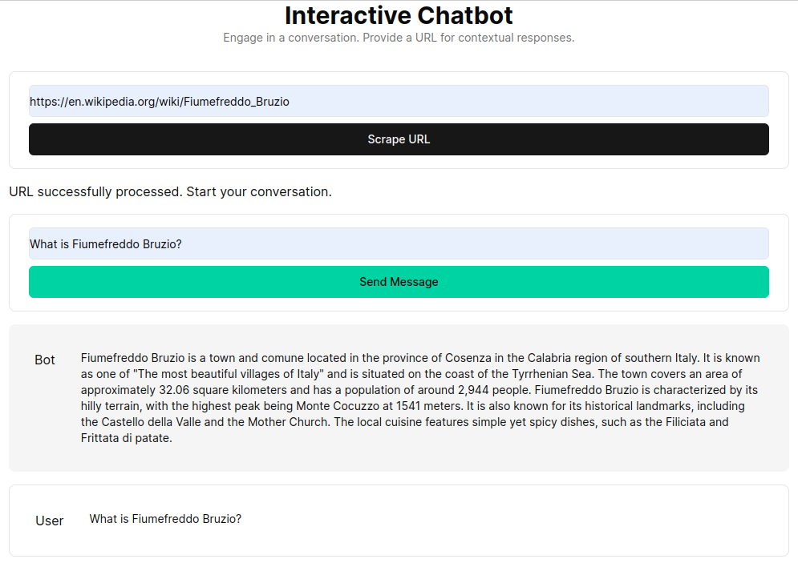

# GitHub Repository Chat App

A full-stack RAG (Retrieval-Augmented Generation) chat application that lets you have intelligent conversations with GitHub repositories. Index any public repository and chat with its codebase using advanced semantic search and AI-powered responses.



## 🚀 Features

- **Repository Indexing**: Automatically scrape and index any public GitHub repository
- **Vector Search**: Semantic search through codebases using Google Gemini embeddings
- **AI-Powered Chat**: Contextual responses powered by Gemini 2.0 Flash and LangChain
- **Modern UI**: Beautiful, responsive chat interface built with Next.js and Tailwind CSS
- **Session Management**: Persistent chat sessions with conversation history
- **Fallback Search**: Text-based search when vector search fails
- **Real-time Updates**: Live status updates and progress indicators

## 🏗️ Architecture

### Frontend (Next.js + Tailwind CSS)

- Modern chat interface with session management
- Repository management and indexing controls
- Real-time status updates and error handling
- Responsive design with dark/light theme support

### Backend (FastAPI + LangChain)

- RESTful API with endpoints for indexing and chat
- Advanced RAG system with vector similarity search
- Google Gemini integration for embeddings and chat
- Supabase integration for vector storage

### Database (Supabase)

- PostgreSQL with vector extension (pgvector)
- Document storage with 768-dimensional embeddings
- Optimized vector similarity search functions

## 🛠️ Tech Stack

- **Frontend**: Next.js 14, React, Tailwind CSS, TypeScript
- **Backend**: FastAPI, LangChain, Python 3.10+
- **AI/ML**: Google Gemini 2.0 Flash, Gemini Embeddings
- **Database**: Supabase (PostgreSQL + pgvector)
- **Deployment**: Vercel (Frontend), Railway (Backend)

## 🚀 Quick Start

### Prerequisites

- Python 3.10+
- Node.js 18+
- Supabase account
- Google AI API key

### Backend Setup

1. **Clone and navigate to backend**:

   ```bash
   cd backend
   python -m venv venv
   source venv/bin/activate  # Windows: venv\Scripts\activate
   pip install -r requirements.txt
   ```

2. **Configure environment variables**:

   ```bash
   cp .env.example .env
   # Edit .env with your actual values
   ```

3. **Start the backend**:

   ```bash
   uvicorn main:app --reload --host 0.0.0.0 --port 8000
   ```

### Frontend Setup

1. **Install dependencies**:

   ```bash
   npm install
   ```

2. **Configure environment**:

   ```bash
   # Create .env.local
   NEXT_PUBLIC_API_URL=http://localhost:8000
   ```

3. **Start the frontend**:

   ```bash
   npm run dev
   ```

4. **Access the application**: [http://localhost:3000](http://localhost:3000)

## 📚 API Endpoints

- `GET /api/health` - Health check
- `POST /api/index` - Index a GitHub repository
- `POST /api/chat` - Chat with indexed repositories
- `GET /api/docs-count` - Get document count
- `DELETE /api/clear` - Clear all documents

## 🗄️ Database Schema

### Documents Table

```sql
CREATE TABLE documents (
  id SERIAL PRIMARY KEY,
  content TEXT NOT NULL,
  metadata JSONB,
  embedding VECTOR(768),
  created_at TIMESTAMP DEFAULT NOW()
);
```

## 📋 Environment Variables

### Backend (.env)

```env
SUPABASE_URL=your_supabase_url
SUPABASE_KEY=your_supabase_anon_key
GOOGLE_API_KEY=your_google_ai_api_key
```

### Frontend (.env.local)

```env
NEXT_PUBLIC_API_URL=your_backend_url
```

## 🔧 Development Status

### ✅ Completed

- Full RAG system implementation
- Vector search with Gemini embeddings
- Modern React frontend with session management
- GitHub repository indexing
- Supabase integration
- Local development environment
- Production build optimization

### 🚧 In Progress

- Railway backend deployment
- Production environment configuration

### 📋 Pending

- Vercel frontend deployment
- End-to-end production testing
- Performance optimization

## 🚀 Deployment

### Backend (Railway)

```bash
cd backend
railway login
railway init
railway up
```

### Frontend (Vercel)

```bash
npm run build
vercel --prod
```

See [DEPLOYMENT.md](DEPLOYMENT.md) for detailed deployment instructions.

## 📖 Comprehensive Codebase Analysis

### Project Overview

This is a **full-stack AI chat application** that enables intelligent conversations with GitHub repositories using RAG (Retrieval Augmented Generation) technology. The system can index any public GitHub repository, convert the codebase into searchable embeddings, and provide contextual AI-powered responses about the code.

### How It Works

1. **Repository Indexing**: User provides a GitHub repository URL
2. **Code Processing**: System clones and processes all repository files
3. **Embedding Generation**: Code chunks are converted to 768-dimensional vectors using Google Gemini
4. **Vector Storage**: Embeddings stored in Supabase with PostgreSQL + pgvector
5. **Intelligent Chat**: When users ask questions:
   - Questions are converted to embeddings
   - Vector similarity search finds relevant code chunks
   - AI generates comprehensive answers using retrieved context

### Key Features Deep Dive

#### 🤖 Advanced RAG System

- **Enhanced Mode**: Conversation memory with multi-turn context awareness
- **Basic Mode**: Stateless responses for quick queries
- **Fallback Search**: Text-based search when vector search fails
- **Smart Chunking**: Intelligent code segmentation preserving context

#### 🔍 Vector Search Technology

- **Semantic Understanding**: Goes beyond keyword matching
- **Code Context Awareness**: Understands relationships between functions, classes, and modules
- **Multi-language Support**: Works with any programming language
- **Relevance Scoring**: Returns most contextually relevant code snippets

#### 💬 Chat Interface

- **Real-time Responses**: Live streaming of AI responses
- **Session Management**: Persistent conversation history
- **Code Highlighting**: Syntax highlighting for code snippets in responses
- **Progress Indicators**: Real-time indexing progress and status updates

### Technical Architecture

#### Frontend (Next.js)

```text
app/
├── page.tsx                 # Main chat interface
├── layout.tsx              # App layout and providers
├── globals.css             # Global styles and Tailwind config
└── constants.ts            # Application constants

components/
├── ui/                     # Reusable UI components (button, input, etc.)
├── heading.tsx             # Page headers and titles
├── loader.tsx              # Loading animations
└── tool-card.tsx           # Feature showcase cards
```

#### Backend (FastAPI)

```text
backend/
├── main.py                 # FastAPI application entry point
├── enhanced_rag_system.py  # Core RAG implementation
├── rag_simple.py           # Basic RAG functionality
├── debug_*.py              # Development and testing utilities
└── test_*.py               # Test suites
```

#### Core Components

**RAG System (`enhanced_rag_system.py`)**:

- `EnhancedRAGSystem` class with conversation memory
- Vector similarity search with configurable thresholds
- Multi-model AI support (Gemini 2.0 Flash)
- Automatic fallback mechanisms

**GitHub Integration**:

- Repository cloning and file processing
- Intelligent file filtering (excludes binaries, large files)
- Code chunking with overlap for context preservation
- Metadata extraction for better search relevance

**Database Layer (Supabase)**:

- PostgreSQL with pgvector extension
- 768-dimensional embedding storage
- Optimized similarity search functions
- JSONB metadata for flexible document properties

### API Endpoints Detail

- `POST /api/index`: Repository indexing with progress tracking
- `POST /api/chat`: Intelligent chat with context awareness
- `GET /api/health`: System health and status monitoring
- `GET /api/docs-count`: Document count and statistics
- `DELETE /api/clear`: Database cleanup and reset

### Development Features

#### Testing & Debugging

- Comprehensive test suites for all major components
- Debug utilities for embedding analysis
- Vector search testing and optimization
- End-to-end integration testing

#### Error Handling

- Graceful degradation when services are unavailable
- Comprehensive error logging and monitoring
- User-friendly error messages
- Automatic retry mechanisms

#### Performance Optimization

- Efficient vector similarity search
- Smart caching of embeddings
- Optimized database queries
- Lazy loading of large repositories

### Use Cases

1. **Code Understanding**: "Explain how authentication works in this app"
2. **Feature Discovery**: "What testing frameworks are used here?"
3. **Architecture Analysis**: "Show me the database schema and relationships"
4. **Bug Investigation**: "Find potential security vulnerabilities"
5. **Documentation**: "Generate documentation for the API endpoints"

This application essentially creates a "ChatGPT for your codebase" experience, making it easy for developers to understand, explore, and get insights about any GitHub repository through natural language conversations.

## Inspiration and References
